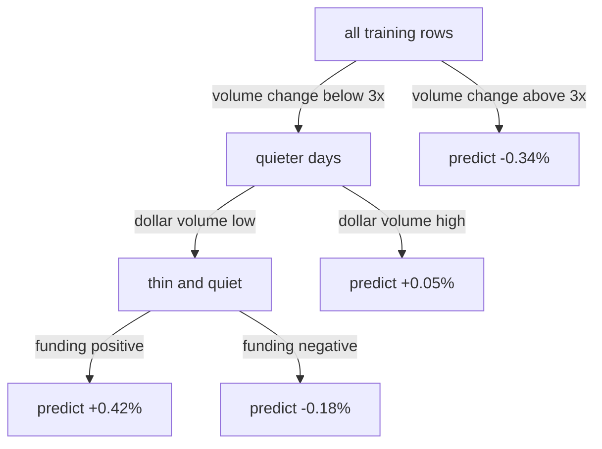

# The value of non-parametric ML methods in cross-sectional crypto returns

We rank cryptocurrency perpetual futures by expected next-day relative return and
ask a narrower question than whether the ranking makes money: does the number of
features decide whether flexible models beat linear ones? We fit the same four
models twice, once on eight features and once on 114, holding the rows, the splits
and the random seeds fixed, and find that the winner changes. The features are the
standard cross-sectional families: recent returns, volatility, funding, liquidity and
where the price sits in its recent range, measured at one horizon each in the small
set and at several in the large.

## Cross-sectional ranking

Each day we observe around 500 perpetual futures on Binance. For each one we predict
its next-day return minus the average next-day return across the whole
cross-section, and the ranking of those predictions is the output. Subtracting the
average is what makes this a relative bet. Crypto is dominated by a single common
move, and when Bitcoin falls almost everything falls with it; that move is far
larger than anything specific to an individual contract. Removing it leaves the part
that might be forecastable, and it makes the resulting portfolio market neutral by
construction rather than by hedging.

The trade implied by a ranking is to buy the top decile, short the bottom decile and
hold for a day. Perpetuals suit this, since a short position is a contract rather
than a borrowed asset, so both legs are equally available on every contract in the
panel.

Return rank persistence from one day to the next is -0.049. That is the correlation
between today's ordering of the contracts by return and tomorrow's ordering of the
same contracts, averaged over days, and at -0.049 it is close to nothing. Today's
ranking does not carry over, so whatever ordering a model produces has to come from
the features rather than from copying yesterday's answer.

## Features

Two feature sets are used throughout: the eight and the 114. The small set takes one
feature from each family below; the large set widens every family and adds
cross-sectional ranks and a few products.

| family         | small set               | large set                                                                                                                                                      |
| -------------- | ----------------------- | -------------------------------------------------------------------------------------------------------------------------------------------------------------- |
| returns        | `ret1`, `ret5`, `ret20` | `pct_change(h)` for h in 1, 2, 3, 5, 10, 15, 20, 30, 60, 90                                                                                                    |
| risk shape     | `vol20`                 | rolling std, skew and kurtosis of `ret1` at 5, 10, 20, 30, 60                                                                                                  |
| funding        | `pay1`, `pay5`          | rolling mean and std of `pay` at 3, 5, 10, 20, 60; lags 1, 2, 3, 5; sign; sign flips; payments per day                                                         |
| liquidity      | `logdv`, `dvchg20`      | `log(close x volume)`; `dv` over its own rolling mean at 5, 10, 20, 60; rolling std of `dv` over its mean; Amihud `abs(ret)/dv`, raw and smoothed at 10 and 30 |
| price location | —                       | position within rolling high-low range at 10, 20, 60; drawdown from rolling high at each; days since listing                                                   |
| market state   | —                       | cross-sectional mean return; its 20-day rolling std; return minus that mean                                                                                    |
| ranks          | —                       | cross-sectional percentile rank, within each day, of the features above                                                                                        |
| interactions   | —                       | `pay x logdv`, `pay x std20`, `ret20 / std20`, `ret x amihud`                                                                                                  |

`vol20` and `std20` are the same quantity, twenty-day realised volatility, named
differently in the two sets.

Every feature is deliberately scale free. Bitcoin trades near 65,000 and small
contracts near 0.02, so a raw price tells the model which contract it is looking at
rather than what is happening to it. Returns, log volume, ratios to a contract's own
history and cross-sectional ranks are all comparable across the panel, which is what
allows one model fitted across 543 contracts to learn a relationship that holds for
all of them.

Extreme outcomes are capped rather than dropped. We take the 0.5th and 99.5th
percentile of the target across the whole panel and clip anything beyond them to
those values, which is called winsorising. Crypto produces days where a contract
returns several hundred percent, and one such row dominates a squared-error fit
because the loss grows with the square of the error. Capping the tails roughly doubled every model's out-of-sample performance.

We keep contract-days with more than one million dollars of volume and days with more
than 100 surviving contracts. The first threshold matters a great deal and is
revisited below. The second is because ranking into deciles needs breadth, and with
twenty contracts a decile is two names and the spread is noise.

## Parametric and non-parametric models

A linear model assumes each feature contributes independently and always in the same
direction. If momentum has a coefficient of 0.3 then it adds 0.3 per unit of
momentum whether the contract is liquid or illiquid, calm or volatile. That is a
strong assumption, and it is also efficient, since only one number per feature has
to be estimated.

A tree assumes nothing about the functional form. It partitions the sample on one
feature at a time, recursively, so each condition is evaluated only on the subsample
its parent produced. A leaf reached by three successive conditions holds the rows
satisfying all three jointly, and its mean outcome is therefore conditional on that
conjunction rather than on any feature separately. A linear specification cannot
represent the same thing unless the product terms are constructed in advance. The
cost is variance: refitting on a resample of the same data relocates the splits,
which is why an ensemble of many trees is averaged rather than one being used alone.



We use four models arranged so that each pair differs in exactly one design choice.

|             | parametric | non-parametric            |
| ----------- | ---------- | ------------------------- |
| plain       | linear     | random forest, best split |
| regularised | ridge      | extra trees, random split |

Left to right isolates whether flexibility helps. Top to bottom isolates
regularisation, in the sense that ridge penalises large coefficients and extra trees
randomises where its splits fall.

## How a tree chooses a split

At each node the algorithm chooses one feature and one threshold on that feature.
The cost of a candidate split is the total squared deviation of the outcome within
each of the two resulting groups,

```
cost(t) = sum over left  (y - ybar_left)^2
        + sum over right (y - ybar_right)^2
```

and the split with the lowest cost is kept. Each leaf then predicts the mean of the
rows that reached it, which follows from the loss rather than being a convention;
differentiating the same expression with respect to a single constant gives the mean
as the minimiser.


Thresholds are not continuous choices in practice. The cost only changes when the
threshold crosses a data value, since that is the only way a row moves from one side
to the other, so the function is flat between adjacent values and there are at most
n-1 distinct splits on a feature with n rows.

The two tree models differ in how the threshold is arrived at. Random forest sorts
the rows by the feature and evaluates every midpoint between adjacent values. Our
training block has 79,433 rows and a typical feature takes around 61,000 distinct
values, so with 114 features that is roughly seven million evaluations at the root
node alone, repeated at every node below. Extra trees draws one threshold per
feature uniformly between that feature's minimum and maximum at the node, giving 114
candidates, and keeps the best of those. It still chooses the feature by comparison;
it simply does not ask whether the cut on that feature was the best available one.

Choosing a worse split deliberately sounds counter-intuitive but is done with the
intention of minimising variance. An optimised threshold is fitted to the sample it
was chosen on, including the noise in that sample, and when the signal is as weak as
next-day returns most of what the search is minimising against is noise. A randomly
drawn threshold cannot overfit in that way. Each individual tree is worse, which is
to say more biased, but the trees end up far less similar to one another, so
averaging cancels more of their error. Mentch and Zhou (2020) show that split
randomisation reduces the effective degrees of freedom of a forest and that forests
beat plain bagging in low and medium signal-to-noise settings while bagging wins
when the signal is strong; their conclusion is that forests win on real data because
real data is noisy.

## Method

Every row is one contract on one day. It carries the features outlined before, all
computed from data available at that day's close, and the outcome we are trying to
predict, which is that contract's return over the following day.

### Bagging

A single tree grown to any depth is unstable. Change the sample slightly and the
first split lands on a different feature, and everything below it changes with it.
The standard remedy is to fit many trees rather than one and average their
predictions, and we fit 80 per model. Averaging only helps to the extent the trees
differ, since averaging near-identical predictions changes nothing, so each tree has
to be made to see the problem slightly differently.

One way to do that is bootstrapping. Each tree is given its own sample of the
training rows, drawn with replacement and of the same size as the original, which
means some rows appear twice and around a third do not appear at all. Every tree
therefore learns from a slightly different version of the data. Random forest works
this way.

Extra trees does not: all 80 trees see the whole training block, and the difference
between them comes entirely from the random thresholds described above.

A prediction for a new row is the average of what all 80 trees return for it, and
that average is what gets ranked.

### Configuration

Both tree models fit 80 trees to a maximum depth of 10, with at least 200 rows per
leaf, and consider all 114 features at every node. Ridge uses a penalty of 1000 on
the sum of squared coefficients, applied after standardising the features so that
the penalty does not fall unevenly on features measured on different scales.

It is worth separating what the fit determines from what we supply. The **learned
parameters** are 114 coefficients for the linear models, and for the trees the
feature and threshold at every node (by computing leaf means and using formula above) all,
computed from the training rows. The **hyperparameters**
are depth, minimum leaf size and the ridge penalty. These cannot be chosen on
training error, because a deeper tree always fits the training rows better and a
smaller penalty always fits them better, so training error would drive flexibility
upwards without limit. Choosing them properly needs a third block of data that the
fit has not seen.

### Parameters and tuning

Depth, leaf size and penalty were fixed by judgement before any
modelling, so the results below describe four models at one configuration of
hyperparameters each. What we do is simple: the training block determines the
 coefficients for the linear models and the  thresholds for the trees,
and the test block is used once to report how each model ranks. Since no
hyperparameter was ever chosen by looking at performance, no validation block was
required, and the panel is split two ways rather than three.

### Splits and seeds

The division into training and test is by date and never at random. A random split
would place a contract's 15 June row in training and its 14 June row in test, and the
features on those two rows are nearly identical, since a twenty-day return shares
nineteen of its twenty days with the day before. The returns themselves are not
persistent, as noted above, but the features are, and that is enough for the model to
recover a test row's answer from its neighbour in training. Splitting by date
guarantees that every training row precedes every test row.

We cut at the 50th, 65th and 80th percentile of dates, giving three train and test
pairs from the same panel, and run each at two random seeds. Both tree models are
stochastic, but for different reasons: random forest draws a fresh bootstrap sample
of the rows for every tree, and extra trees draws a fresh threshold at every node.
The seed fixes those draws, so a single seed tells us nothing about how much of a
result is the draw rather than the data. Linear and ridge are deterministic and give
identical numbers at both seeds. Six fits per model per feature set gives a mean, a
spread, and a paired comparison against another model on matched splits and seeds.

###Metrics

Three metrics do three different jobs. Inside the fit, both model families minimise
squared error on the demeaned return; that is the loss function and it is not what we
report. For reporting we use the rank information coefficient. On each test day we rank
the contracts by prediction, rank them again by realised outcome, and take the
Spearman correlation of the two orderings. The IC is the average of those daily
correlations. Ranks rather than values, because our trading strategy only uses the ordering and never the magnitude of a
prediction, so saying plus 0.4% instead of plus 4% changes nothing as long as the
ordering holds. We compute a correlation for each day and then average, rather than pooling every
test row into one correlation. Pooling would let a day with 500 contracts count for
more than a day with 150, and we trade every day regardless of how many contracts
were listed or how good that day happened to be.

We also report the **decile spread**, the realised return of the actual trade in
basis points per day. Each test day we sort by prediction into ten buckets and take
the mean realised outcome of the top bucket minus the bottom. Rank IC uses the whole
cross-section; the decile spread uses only the hundred contracts that would actually
be held. The two can disagree, and here they do.


## Data

Funding rates come from the Binance USD-margined futures endpoint,

```
fapi.binance.com/fapi/v1/fundingRate
```

and daily prices and volumes from the monthly kline archive,

```
data.binance.vision/?prefix=data/futures/um/monthly/klines/
```

Merging the two and dropping rows where the rolling windows have not filled leaves
112,905 contract-days across 543 perpetuals, from 30 October 2025 to 30 July 2026.
Funding is available to 24 August 2026 but prices stop at the end of July, because
the monthly kline file for August is not published until the month closes.

## Results

| model         | IC, 8 features | IC, 114 features |
| ------------- | -------------- | ---------------- |
| linear        | +0.0605        | +0.0303          |
| ridge         | +0.0610        | +0.0313          |
| random forest | +0.0269        | +0.0399          |
| extra trees   | +0.0388        | +0.0489          |

**Discussion.** The two parametric models get worse as features are added and the
two non-parametric models get better. Linear falls from 0.0605 to 0.0303 and ridge
from 0.0610 to 0.0313, while random forest rises from 0.0269 to 0.0399 and extra
trees from 0.0388 to 0.0489. The ordering of the four models is reversed between the
two columns.

Ridge barely improves on linear in either column, 0.0610 against 0.0605 and 0.0313
against 0.0303. This is informative. If the linear degradation were driven by
collinearity among near-duplicate features, which the large set has in quantity
given returns at ten horizons and volatility at five windows, then shrinking the
coefficients should have recovered a good deal of it. It does not, which points at
ordinary overfitting from parameter count rather than at coefficient instability.

| comparison   | linear  | extra trees | extra trees wins |
| ------------ | ------- | ----------- | ---------------- |
| 8 features   | +0.0605 | +0.0388     | 0 of 6           |
| 114 features | +0.0303 | +0.0489     | 6 of 6           |

Discussion. Extra trees loses on every one of the six fits with eight features
and wins on every one with 114. The reversal holds at all three date cuts and both
seeds.

| split rule                    | IC, 114 features |
| ----------------------------- | ---------------- |
| random forest, best threshold | +0.0399          |
| extra trees, random threshold | +0.0489          |

**Discussion.** Both models bag eighty trees to the same depth and the same minimum
leaf size, and the visible difference between them is whether the threshold at each
node is searched for or drawn at random.


| configuration             | decile spread, bp/day |
| ------------------------- | --------------------- |
| extra trees, 114 features | 125.9                 |
| linear, 8 features        | 76.8                  |

Discussion. The two metrics disagree. Linear on eight features has the higher
rank IC, 0.0605 against 0.0489, and the lower decile spread, 76.8 against 125.9. They
measure different parts of the cross-section: rank IC scores the whole ordering of
around 500 contracts, while the decile spread only depends on which names land in the
top and bottom hundred. A tree carves out extreme regions with hard splits, which
costs it accuracy through the middle and gains it accuracy at the tails. Since the
trade holds only the tails, extra trees on the large feature set is the better model
for this strategy despite ranking worse overall.

### Liquidity

A decile spread of 126 basis points a day is around 360% annualised, which is not a
plausible return and is worth investigating. We refit extra
trees on the large feature set at progressively higher volume floors.

| minimum daily volume | contracts per day | mean, bp/day | std, bp/day | Sharpe |
| -------------------- | ----------------- | ------------ | ----------- | ------ |
| $1m                  | 435               | 112.6        | 192.0       | 11.21  |
| $10m                 | 133               | 112.5        | 388.8       | 5.53   |
| $50m                 | 59                | 17.2         | 651.7       | 0.50   |

Discussion. The return disappears once the universe is restricted to contracts
large enough to trade. Requiring fifty million dollars of daily volume cuts the mean
from 113 basis points to 17 and the Sharpe ratio from 11.2 to 0.5. What the model was
ranking on, in other words, was small contracts, and illiquid assets earn higher
returns precisely because they are hard to trade, so that return is not available to
anyone trying to take it. There is no practical edge here.

The last row rests on thin evidence. With only 59 contracts a day, each decile holds
about six names, and averaging six returns gives a noisy figure; the standard
deviation is 652 basis points against 192 in the first row. So the 0.50 should not be
taken as a precise number. The fall from 11.2 to 0.5 across the three rows is much
larger than that imprecision, and it is the fall that matters.

None of this affects the comparison between models, which is a relative statement on
identical data.

## Files

```
code/features.py    loading, both feature sets, target construction and filters
code/model.py       the four estimators, rank IC, evaluation across splits and seeds
code/run.py         builds the panel, runs the comparison, prints the tables
```

## Running it

```
pip install -r requirements.txt
python code/run.py
```

Run from the repository root, since the data paths are relative to it. Expect around
ten minutes, almost all of it in the random forest fits, which search every
candidate threshold across 114 features at every node.

## Limitations

Hyperparameters were fixed before modelling rather than tuned. Depth 10, minimum
leaf 200 and a ridge penalty of 1000 were chosen by judgement, so the comparison is
between four models at one configuration each rather than between four models at
their best. The gap on the large feature set is wide relative to its variation across
fits, which makes a reversal under tuning unlikely, but this was not tested.

The panel is fitted once on the earliest 70% of dates and applied to the remainder,
rather than refitted on a rolling basis and walked forward. A rolling refit is closer
to how a strategy would run and is what Gu, Kelly and Xiu (2020) use. The fixed
split is adequate for comparing model classes, which is the question here, but the
reported ICs are not a simulation of deployment.

Bootstrap resampling assumes rows are independent. Contract-days are not: contracts
on the same date share a common factor and each contract's own rows are serially
correlated, so the panel structure is broken by resampling. This is standard
practice and works adequately, but the assumption is violated.

Costs are not modelled beyond the liquidity sweep. The sample covers nine months of one exchange.

## References

Geurts, P., Ernst, D. and Wehenkel, L. (2006). Extremely randomized trees.
*Machine Learning*, 63(1), 3-42.

Gu, S., Kelly, B. and Xiu, D. (2020). Empirical asset pricing via machine learning.
*Review of Financial Studies*, 33(5), 2223-2273.

Mentch, L. and Zhou, S. (2020). Randomization as regularization: a degrees of
freedom explanation for random forest success. *Journal of Machine Learning
Research*, 21(171), 1-36.
